# Retribusi SIPANDA: System Diagrams & Logic

This document provides a visual deep dive into the operation of the SIPANDA ecosystem.

## 1. Professional Multi-Repo Architecture
The system is divided into four distinct repositories, coordinated by the **SIPANDA CORE API**.

```mermaid
%%{init: {'theme':'base', 'themeVariables': { 'primaryColor':'#10b981','primaryTextColor':'#fff','primaryBorderColor':'#059669','lineColor':'#6366f1','secondaryColor':'#3b82f6','tertiaryColor':'#8b5cf6','background':'#1e293b','mainBkg':'#334155','secondBkg':'#475569','tertiaryBkg':'#64748b','textColor':'#f1f5f9','fontSize':'16px','fontFamily':'Inter, system-ui, sans-serif'}}}%%
graph TB
    %% Core API Layer - The Heart of the System
    subgraph CORE["🏛️ CORE ENGINE (retribusi-api)"]
        direction TB
        API["⚡ Laravel REST API<br/>───────────<br/>Authentication • CRUD<br/>Business Logic"]
        DB[("💾 MySQL Database<br/>───────────<br/>users • tax_objects<br/>bills • payments")]
        Storage["☁️ Cloudinary Storage<br/>───────────<br/>KTP • NPWP • Photos<br/>Documents • QR Codes"]
        
        API -.->|"ORM (Eloquent)"| DB
        API -.->|"File Upload"| Storage
    end

    %% Admin Dashboard
    subgraph ADMIN["👔 ADMIN HUB (retribusi-admin)"]
        direction TB
        Dashboard["📊 Web Dashboard<br/>───────────<br/>Next.js • TypeScript"]
        Analytics["📈 Revenue Analytics<br/>───────────<br/>Charts • Reports"]
        Verification["✅ Verification Center<br/>───────────<br/>Approve/Reject WP"]
        
        Dashboard --> Analytics
        Dashboard --> Verification
    end

    %% Field Officers
    subgraph PETUGAS["🚶 FIELD OFFICERS (retribusi-petugas)"]
        direction TB
        FieldApp["📱 Field Application<br/>───────────<br/>React • PWA"]
        QRScanner["📷 QR/Barcode Scanner<br/>───────────<br/>Quick Verification"]
        PaymentCollector["💰 Payment Collection<br/>───────────<br/>Cash • Transfer"]
        
        FieldApp --> QRScanner
        FieldApp --> PaymentCollector
    end

    %% Citizen Portal
    subgraph MOBILE["👥 CITIZEN PORTAL (retribusi-mobile)"]
        direction TB
        CitizenPWA["📲 Mobile PWA<br/>───────────<br/>React Native Web"]
        BillViewer["🧾 Bill Viewer<br/>───────────<br/>Tagihan • History"]
        ServiceHub["🏢 Service Hub<br/>───────────<br/>Registration • Layanan"]
        
        CitizenPWA --> BillViewer
        CitizenPWA --> ServiceHub
    end

    %% Connections
    API <==>|"REST API<br/>JSON"| Dashboard
    API <==>|"REST API<br/>JSON"| FieldApp
    API <==>|"REST API<br/>JSON"| CitizenPWA
    
    %% Styling
    classDef coreStyle fill:#10b981,stroke:#059669,stroke-width:3px,color:#fff
    classDef adminStyle fill:#3b82f6,stroke:#2563eb,stroke-width:3px,color:#fff
    classDef petugasStyle fill:#8b5cf6,stroke:#7c3aed,stroke-width:3px,color:#fff
    classDef mobileStyle fill:#f59e0b,stroke:#d97706,stroke-width:3px,color:#fff
    classDef dbStyle fill:#ef4444,stroke:#dc2626,stroke-width:3px,color:#fff
    
    class API,Storage coreStyle
    class DB dbStyle
    class Dashboard,Analytics,Verification adminStyle
    class FieldApp,QRScanner,PaymentCollector petugasStyle
    class CitizenPWA,BillViewer,ServiceHub mobileStyle
```

---

## 2. Dynamic Registration & Verification Mechanism
One of SIPANDA's most complex features is the **Dynamic Form Registration**. The API provides a `form_schema` which the frontends render dynamically.

---

## 3. Billing & Payment Ecosystem
The system generates bills based on `rates` and `zones`.

---

## 4. User Persistence & Authentication (Sanctum)
Mechanism for managing session across apps.

---

## 5. Visual Summary

