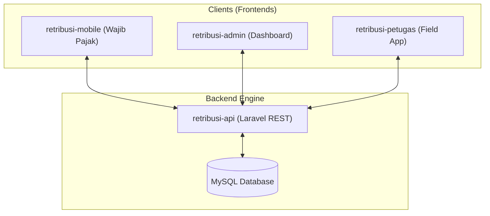
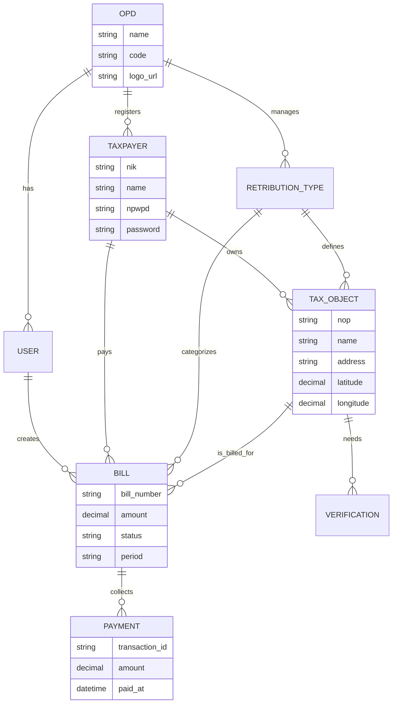
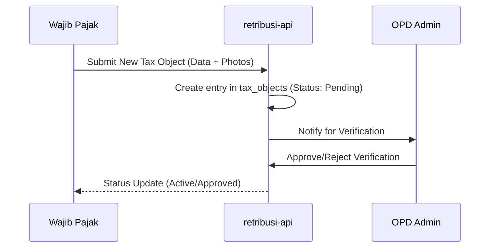
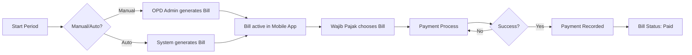

# Retribusi SIPANDA: System Deep Dive & Architecture

SIPANDA is an integrated ecosystem for managing local retributions and taxes, consisting of four specialized repositories that work together in a unified data environment.

## 1. System Architecture

The ecosystem follows a modern decoupled architecture:

### Core Technologies
- **Backend**: Laravel 11, PHP 8.2+, MySQL.
- **Frontend**: React (Vite), Tailwind CSS, Lucide Icons.
- **Authentication**: Laravel Sanctum (Token-based SPA/Mobile Auth).
- **Communication**: RESTful JSON API via Axios.

---

## 2. Database Schema (Schema Database)

The heart of the system is the `retribusi-api` database. Below is the simplified relationship map:

### Primary Entities
| Table | Description | Key Relationships |
|-------|-------------|-------------------|
| `opds` | Organization units (e.g., BAPENDA, DISHUB). | One-to-Many with Users, Taxpayers, and Types. |
| `users` | Staff/Admins (Super Admin, OPD Admin, Petugas). | BelongsTo `opds`. |
| `taxpayers` | Wajib Pajak (Citizens). Authenticates via NIK. | BelongsTo `opds` (optional), HasMany `tax_objects`. |
| `retribution_types` | Tax categories (PBJT, Reklame, Parkir, etc.). | BelongsTo `opds`, HasMany `tax_objects`. |
| `tax_objects` | Specific physical/business entities being taxed. | BelongsTo `taxpayers`, `retribution_types`, `zones`. |
| `bills` | The actual invoices/tagihan. | BelongsTo `tax_objects`, `taxpayers`, `opds`. |
| `payments` | Transaction records. | BelongsTo `bills`. |
| `verifications` | Audit trail for new tax object registrations. | BelongsTo `taxpayers` and `tax_objects`. |

### Database Relationship Diagram (ERD)

---

## 3. Use Case & Actor Roles

### 1. Super Admin (Global Controller)
- **Role**: Total system oversight.
- **Workflow**: 
    - Verify and approve new OPD registration requests.
    - Create and manage OPD Admin accounts.
    - Analyze high-level revenue trends across all departments.

### 2. OPD Admin (Departmental Master)
- **Role**: Manages specific department logic (e.g., Bapenda Admin).
- **Workflow**:
    - Configure `retribution_types` (pricing, form schemas for registration).
    - Manage and audit `taxpayers` and `tax_objects`.
    - Verification of field data submitted by Citizens or Petugas.
    - Generate bulk billing (`bills`) for periodic retributions.

### 3. Petugas / Petugas (Field & Transaction)
- **Role**: Field data collection and manual payment processing.
- **Workflow**:
    - Input data for new tax objects in the field.
    - Process on-the-spot payments and generate receipts.
    - View assignments and collection targets.

### 4. Wajib Pajak (Citizen / User)
- **Role**: The end-user paying the retribution.
- **Workflow**:
    - Self-registration of business/tax objects via Mobile App.
    - Checking active bills (`Tagihan`) in real-time.
    - Viewing personal payment history.
    - Submitting complaints or feedback (`Pengaduan`).

---

## 4. Operational Flowcharts

### A. Tax Object Registration Flow

### B. Billing & Payment Flow

---

## 5. Repository Mechanism Detail

1. **retribusi-api (The Engine)**:
    - Uses Laravel Sanctum for secure API tokens.
    - Logic for complex rate calculations based on `zones` and `classifications`.
    - Cloudinary integration for permanent image storage (OPD logos, verification photos).

2. **retribusi-admin (The Brain)**:
    - High-density data tables for managing thousands of records.
    - Dynamic form builders based on API-returned schemas.
    - Advanced charting (Recharts) for revenue analytics.

3. **retribusi-mobile (The Portal)**:
    - Mobile-first responsive design (PWA-ready).
    - Simplified UI for non-technical users to pay bills.
    - Location tracking (via browser geolocation) for tax object registration.

4. **retribusi-petugas (The Field Tool)**:
    - Specialized for mobile field work.
    - Simplified forms for quick data entry.
    - QR scanning ready (for bill identification).
